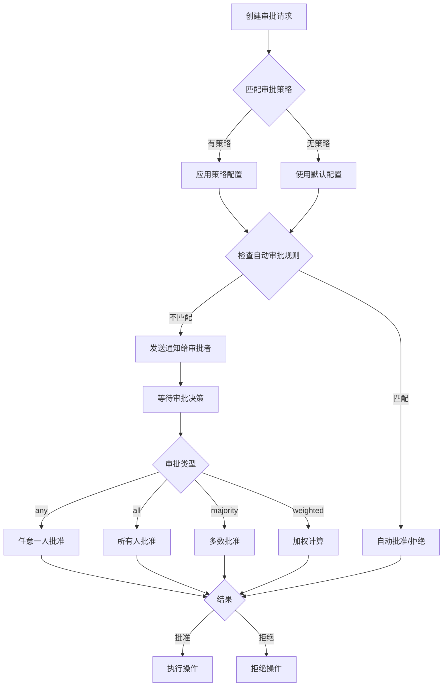

# Phase 7: 人类超级管理员与审批系统

## 📋 概述

Phase 7 在 **Phase 3 企业级权限体系** 的基础上，提供了完整的超级管理员管理和高级审批工作流系统。

### 核心功能

1. **超级管理员管理** - 5种管理员角色，细粒度权限控制
2. **高级审批系统** - 多级审批链、加权审批、自动升级
3. **紧急访问管理** - 临时权限提升，完整审计追踪
4. **通知系统** - 多渠道通知（邮件、Slack、Webhook、Telegram）
5. **会话管理** - MFA、IP白名单、并发控制
6. **审计日志** - 完整的操作记录和统计分析

## 🏗️ 架构

```
src/admin/
├── types.ts                    # 核心类型定义（447行）
├── super-admin-manager.ts      # 超级管理员管理器（602行）
├── advanced-approval.ts        # 高级审批系统（712行）
├── notification-manager.ts     # 通知管理器（545行）
├── phase7-integration.ts       # Phase 7 集成器（564行）
├── integration-example.ts      # 集成示例（352行）
└── index.ts                    # 模块导出（21行）
```

**总代码量**: 3,243 行

## 🎯 主要特性

### 1. 超级管理员角色

| 角色               | 权限范围                   | 说明                 |
| ------------------ | -------------------------- | -------------------- |
| `system-admin`     | 所有权限 (`*`)             | 系统管理员，最高权限 |
| `security-admin`   | 权限、审批、审计、紧急访问 | 安全管理员           |
| `compliance-admin` | 审批、审计查看和导出       | 合规管理员           |
| `operations-admin` | 智能助手管理、系统配置     | 运营管理员           |
| `audit-viewer`     | 审计查看、审批查看         | 审计查看员           |

### 2. 审批类型

- **单审批者** (`any`) - 任意一个审批者同意即可
- **全员审批** (`all`) - 所有审批者必须同意
- **多数审批** (`majority`) - 超过半数同意
- **加权审批** (`weighted`) - 基于权重的审批决策

### 3. 审批优先级

- `emergency` - 紧急（红色）
- `urgent` - 紧迫（橙色）
- `high` - 高（黄色）
- `normal` - 普通（蓝色）
- `low` - 低（灰色）

### 4. 操作类型

```typescript
type AdminOperationType =
  | "agent_create" // 创建智能助手
  | "agent_delete" // 删除智能助手
  | "agent_suspend" // 暂停智能助手
  | "agent_activate" // 激活智能助手
  | "agent_config_change" // 修改智能助手配置
  | "permission_grant" // 授予权限
  | "permission_revoke" // 撤销权限
  | "approval_override" // 审批覆盖
  | "system_config_change" // 系统配置修改
  | "emergency_stop" // 紧急停止
  | "audit_export" // 审计日志导出
  | "user_management"; // 用户管理
```

## 🚀 快速开始

### 1. 初始化系统

```typescript
import { initializePhase7 } from "./src/admin/index.js";

initializePhase7({
  adminConfig: {
    superAdmins: [
      {
        id: "admin-001",
        userId: "user-001",
        role: "system-admin",
        name: "System Administrator",
        email: "admin@example.com",
        permissions: ["*"],
        isActive: true,
        isOnline: false,
        mfaEnabled: true,
        createdAt: Date.now(),
        createdBy: "system",
      },
    ],
    approvalPolicies: [],
    defaultApprovalConfig: {
      approvers: [{ type: "user", id: "admin-001" }],
      requiredApprovals: 1,
      timeout: 3600,
    },
    sessionTimeout: 3600,
    maxConcurrentSessions: 3,
    requireMfa: true,
    // ... 其他配置
  },
  notificationConfig: {
    email: { enabled: true },
    slack: { enabled: true, webhookUrl: "https://..." },
  },
});
```

### 2. 管理员登录

```typescript
import { phase7Integration } from "./src/admin/index.js";

const result = await phase7Integration.adminLoginWorkflow({
  adminId: "admin-001",
  ipAddress: "192.168.1.100",
  userAgent: "Mozilla/5.0...",
  mfaCode: "123456",
});

if (result.success) {
  console.log("Session ID:", result.session.id);
}
```

### 3. 创建审批请求

```typescript
const request = await phase7Integration.createApprovalRequest({
  requester: { type: "user", id: "admin-002" },
  requestedAction: "agent_delete",
  targetType: "agent",
  targetId: "agent-123",
  title: "Delete Inactive Agent",
  description: "Request to delete agent-123",
  reason: "Inactive for 90 days",
  priority: "high",
});

console.log("Request ID:", request.id);
```

### 4. 处理审批

```typescript
const result = await phase7Integration.processApprovalDecision({
  requestId: request.id,
  approver: { type: "user", id: "admin-001" },
  decision: "approve",
  comment: "Approved",
  timestamp: Date.now(),
});

console.log("Status:", result.status);
```

### 5. 紧急访问

```typescript
const emergencyRequest = phase7Integration.createEmergencyAccessRequest({
  requester: admin,
  emergencyType: "system-outage",
  description: "Critical system outage",
  severity: "critical",
  requestedPermissions: ["database.admin"],
  duration: 3600,
});

// 授予访问
const granted = phase7Integration.grantEmergencyAccess(emergencyRequest.id, "admin-001");
```

## 🔗 与 Phase 3 集成

Phase 7 和 Phase 3 紧密集成，形成完整的权限管理生态：

```typescript
// Phase 3: 基础权限检查
import { PermissionChecker } from "./src/permissions/checker.js";
const checker = new PermissionChecker(permissionConfig);

const checkResult = await checker.check({
  subject: { type: "user", id: "user-123" },
  toolName: "delete_agent",
});

if (checkResult.requiresApproval) {
  // Phase 7: 创建审批流程
  const approval = await phase7Integration.createApprovalRequest({
    requester: { type: "user", id: "user-123" },
    requestedAction: "agent_delete",
    targetType: "agent",
    targetId: "agent-456",
    title: "Delete Agent Request",
    description: "User requests to delete agent",
    reason: checkResult.reason || "User request",
  });

  // 等待审批...
}
```

## 📊 审批工作流



## 🔒 安全特性

### 1. 多因素认证 (MFA)

```typescript
// 创建会话时验证 MFA
const session = superAdminManager.createSession({
  adminId: "admin-001",
  ipAddress: "192.168.1.100",
  userAgent: "Mozilla/5.0...",
});

// 验证 MFA 码
const verified = superAdminManager.verifyMfa(session.id, "123456");
```

### 2. IP 白名单

```typescript
const admin = {
  // ...
  ipWhitelist: ["192.168.1.0/24", "10.0.0.*"],
};
```

### 3. 会话管理

- 会话超时自动失效
- 最大并发会话限制
- 手动终止会话
- 会话活动追踪

### 4. 审计日志

所有管理员操作都被记录：

```typescript
const operations = superAdminManager.getOperationHistory({
  adminId: "admin-001",
  operationType: "agent_delete",
  startTime: Date.now() - 7 * 24 * 60 * 60 * 1000, // 最近7天
});
```

## 📈 统计和监控

### 审批统计

```typescript
const stats = phase7Integration.getApprovalStatistics({
  startTime: Date.now() - 30 * 24 * 60 * 60 * 1000,
  endTime: Date.now(),
  approverId: "admin-001",
});

console.log("总请求数:", stats.totalRequests);
console.log("平均审批时间:", stats.averageApprovalTime);
console.log("按优先级:", stats.byPriority);
console.log("按操作类型:", stats.byOperationType);
```

### 系统健康检查

```typescript
const health = phase7Integration.healthCheck();

console.log("初始化状态:", health.initialized);
console.log("活跃管理员:", health.statistics.activeAdmins);
console.log("在线管理员:", health.statistics.onlineAdmins);
console.log("待审批数量:", health.statistics.pendingApprovals);
```

## 🔔 通知系统

支持多种通知渠道：

### 1. 邮件通知

```typescript
notificationConfig: {
  email: {
    enabled: true,
    smtpHost: 'smtp.example.com',
    smtpPort: 587,
    from: 'noreply@example.com',
  }
}
```

### 2. Slack 通知

```typescript
notificationConfig: {
  slack: {
    enabled: true,
    webhookUrl: 'https://hooks.slack.com/services/xxx',
    channel: '#admin-alerts',
  }
}
```

### 3. Webhook 通知

```typescript
notificationConfig: {
  webhook: {
    enabled: true,
    url: 'https://your-api.com/webhook',
    headers: {
      'Authorization': 'Bearer token',
    },
  }
}
```

### 4. Telegram 通知

```typescript
notificationConfig: {
  telegram: {
    enabled: true,
    botToken: 'your-bot-token',
    chatId: 'your-chat-id',
  }
}
```

## 🧪 测试

运行示例：

```bash
cd src/admin
npx tsx integration-example.ts
```

清理测试数据：

```typescript
phase7Integration.clearAll();
```

## 📚 API 参考

### SuperAdminManager

- `createSuperAdmin(params)` - 创建超级管理员
- `getSuperAdmin(adminId)` - 获取管理员信息
- `hasPermission(adminId, permission)` - 检查权限
- `createSession(params)` - 创建会话
- `validateSession(sessionId)` - 验证会话
- `recordOperation(params)` - 记录操作
- `getOperationHistory(params)` - 获取操作历史

### AdvancedApprovalSystem

- `createRequest(params)` - 创建审批请求
- `processDecision(decision)` - 处理审批决策
- `getPendingRequests(params)` - 获取待审批请求
- `cancelRequest(requestId)` - 取消审批请求
- `createEmergencyAccess(params)` - 创建紧急访问
- `grantEmergencyAccess(requestId)` - 授予紧急访问
- `getStatistics(params)` - 获取审批统计

### NotificationManager

- `createNotification(params)` - 创建通知
- `getUserNotifications(params)` - 获取用户通知
- `markAsRead(notificationId)` - 标记为已读
- `getUnreadCount(recipientId)` - 获取未读数量

### Phase7Integration

- `initialize(config)` - 初始化系统
- `adminLoginWorkflow(params)` - 管理员登录工作流
- `agentManagementWorkflow(params)` - 智能助手管理工作流
- `completeApprovalWorkflow(params)` - 完整审批工作流
- `healthCheck()` - 健康检查

## 🎓 最佳实践

1. **始终启用 MFA** - 为所有超级管理员启用多因素认证
2. **设置合理的审批策略** - 根据操作风险级别设置不同的审批要求
3. **定期审查审计日志** - 检查异常操作和潜在安全问题
4. **限制紧急访问** - 紧急访问应该有严格的时间限制和审计
5. **多渠道通知** - 配置多个通知渠道确保不遗漏重要消息
6. **权限最小化** - 只授予必要的权限，避免权限过度

## 🔄 版本历史

- **v1.0.0** (2026-02-07) - 初始版本
  - 实现超级管理员管理
  - 实现高级审批系统
  - 实现通知系统
  - 与 Phase 3 权限系统集成

## 📝 许可证

与主项目保持一致

---

**Phase 7 完整实现完成！** ✅

基于 Phase 3 的企业级权限体系，Phase 7 提供了完整的超级管理员和审批工作流功能，形成了一个强大的权限管理生态系统。
